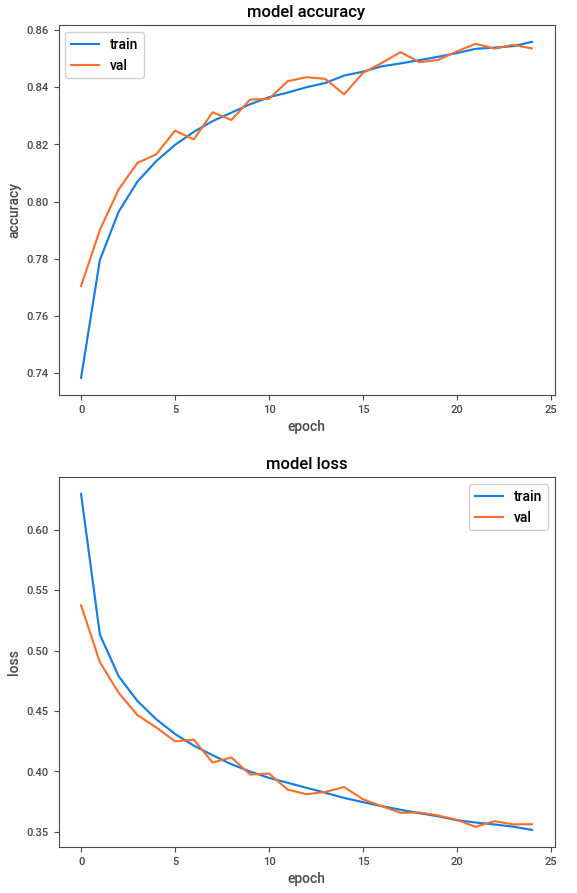

# Forest Cover Type Classification
### Objective

Build a deep learning model to predict forest cover type

### Raw data

- Cover Types: ['Spruce/Fir', 'Lodgepole Pine','Ponderosa Pine', 'Cottonwood/Willow','Aspen', 'Douglas-fir', 'Krummholz']
- cover_data.csv

### Data cleaning

- No missing data (from SWEETVIZ_REPORT.html)
- No duplicates (from SWEETVIZ_REPORT.html)
- No outliers (indirectly from SWEETVIZ_REPORT.html)
- Data normalised
- Top features correlated with class (SweetVIZ report: Elevation, Horizontal_Distance_To_Hydrology, Horizontal_Distance_To_Roadways, Horizontal_Distance_To_Fire_Points, Slope, Hillshade_9am)

### Model

TensorFlow with Keras used to build classifier

### Model Tuning

- Tested different configurations of layers with varying numbers of units
- Learning rates: 0.001 best. Tried 0.01, 0.0001
- Batch size: 250 best. Tried: 100, 500, 1000
- Tested adding dropout: tried applying dropout with rates of 0.1, 0.3 but no improvement
- Tested removal of features. 54 features in total with 40 of those being different soil_type features. Tried removal of rare soil types but metrics were not improved

### Results
 
<table>
  <tr>
    <th>Metric</th>
    <th>Result</th> 
  </tr>
  <tr>
    <td>Test accuracy</td>
    <td>0.85</td> 
  </tr>
  <tr>
    <td>Test loss</td>
    <td>0.36</td> 
  </tr>
  <tr>
    <td>F1 score</td>
    <td>0.85</td> 
  </tr>
</table>
 
Model accurary and loss by epoch for train and validation sets (early stopping):

 

### Next steps

- Automated hyperparameter tuning eg Grid Search, Randomized Search
- Resampling
- Further testing with different layer configurations
- Trial different optimisers during model.compile 
- Further investigations into feature data

